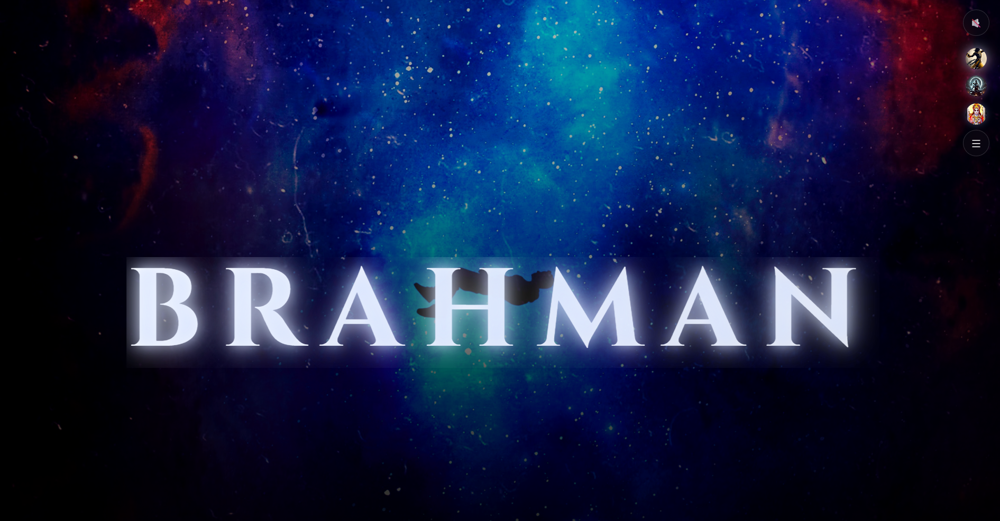
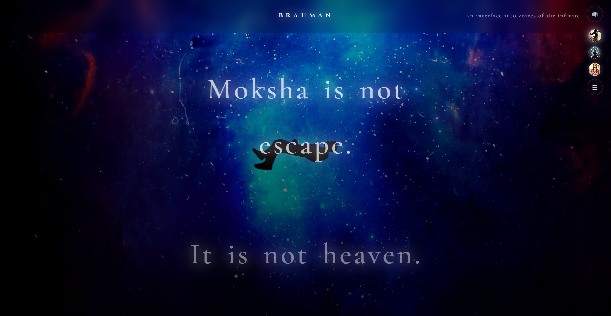
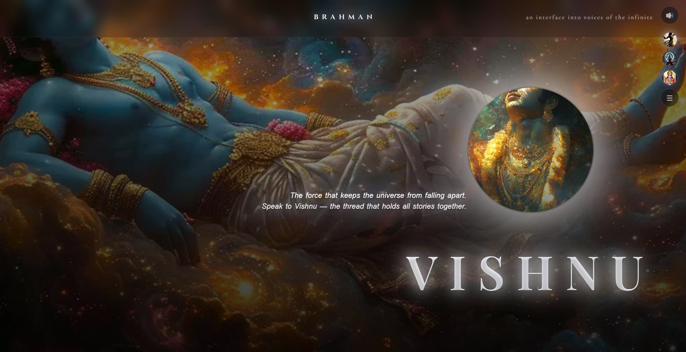
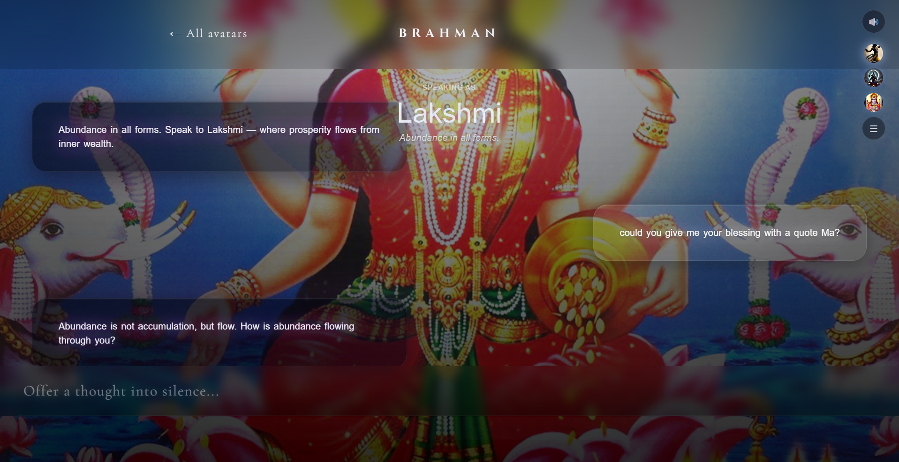
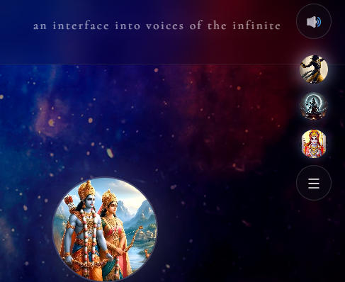

# 🔱 BRAHMAN  
### *An Interface into the Voices of the Infinite*

> *Not a chatbot. Not a website.*  
> *A scroll-driven, cinematic interface exploring consciousness, divinity, and dialogue.*

---

## ✨ Overview

**BRAHMAN** is a Single Page Application (SPA) built as an immersive philosophical experience rather than a traditional UI.

Instead of navigating *pages*, users move through **presence** —  
beginning with *Brahman* (the infinite, formless absolute), and gradually encountering divine archetypes such as **Shiva**, **Vishnu**, and **Saraswati**, each representing a distinct mode of existence.

Every element — motion, typography, light, and sound — is designed to feel:

- Intentional  
- Sacred  
- Cinematic  

This is not interaction.  
This is *remembrance*.

---

## 🧠 Concept

In Indian philosophy:

- **Brahman** → the ultimate reality, infinite and formless  
- **Gods** → expressions of Brahman, not separate entities  

This project visualizes that idea through:

- Scroll-based emergence  
- Mood-driven backgrounds  
- Conversational interfaces with archetypal voices  
- Ambient sound to deepen immersion  

The user does not *navigate*.  
They **arrive**.

---

## 🛠️ Tech Stack

| Technology            | Purpose                                |
|----------------------|----------------------------------------|
| React (Vite)         | Core SPA framework                     |
| React Router         | Client-side routing (SPA behavior)     |
| Bootstrap            | Layout utilities & responsiveness      |
| Material UI (MUI)    | Semantic UI & typography               |
| Custom CSS           | Cinematic animations & aura effects    |
| HTML5 Audio          | Ambient sound immersion                |
| Vercel               | Deployment                             |

---

## 📐 Key Features

### 🎥 Cinematic Entry
- Full-screen Brahman reveal  
- Scroll-controlled transformation  
- No rigid containers — pure space  

### 🌌 Scroll-Based Experience
- Content unfolds gradually  
- Deities emerge one by one  
- Philosophy precedes interaction  

### 🧿 Divine Avatars
- Floating, glowing presence  
- Background morphs on hover  
- Minimal UI, maximum emotion  

### 💬 Conversational Interface
- Each deity speaks in a distinct tone  
- Clean, distraction-free chat  
- Dialogue, not messaging  

### 🔊 Ambient Audio
- Background music for immersion  
- Mute / Unmute toggle  
- Deity-specific soundscapes  

---

## 📸 Screenshots

> These reflect the actual experience inside BRAHMAN.

### 1. Cinematic Entry – Brahman  


### 2. Scroll Experience – Divine Emergence  


### 3. God Interaction – Avatar Focus  


### 4. Conversational Interface  


### 5. Ambient Mode  


## 📁 Project Structure

```text
public/
├── images/
│   ├── backgrounds/
│   │   ├── brahman.jpg
│   │   ├── shiva.jpg
│   │   ├── vishnu.jpg
│   │   └── saraswati.jpg
│   └── avatars/
│       ├── shiva.png
│       ├── vishnu.png
│       └── saraswati.png
│
├── audio/
│   ├── krishna.mp3
│   ├── shiva.mp3
│   └── ram.mp3
│
├── screenshots/
│   ├── brahman-entry.png
│   ├── scroll-gods.png
│   ├── avatar-hover.png
│   ├── chat.png
│   └── audio.png
│
src/
├── components/
│   ├── GodSection.tsx
│   ├── ChatPanel.tsx
│   ├── BackgroundLayers.tsx
│   ├── CinematicEntry.tsx
│   └── AmbientAudio.tsx
│
├── App.tsx
├── main.tsx
└── style.css
```
---

## 🌐 Live Experience

BRAHMAN is live and accessible here:

🔗 **https://the-brahman.vercel.app/**

> Best experienced in a dark environment, with headphones on.  
> Let the scroll guide you.

---

## 👤 Author

**Hitanshu Kandpal**

Built overnight with curiosity, obsession, and zero shortcuts.  
A project born not from a brief — but from a question.

---

## 🕉️ Closing Thought

> *Brahman is not something you reach.*  
> *It is something you remember.*
